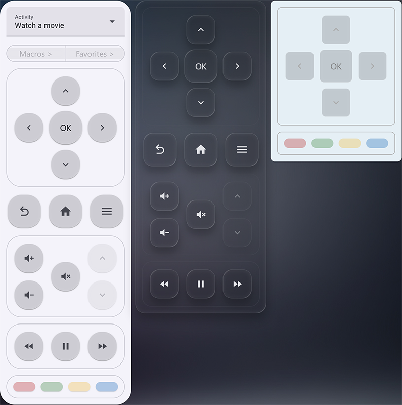

# Sofabaton Virtual Remote for Home Assistant

[](https://github.com/hacs/integration)


A highly customizable virtual remote for your lovelace dashboard. It works with the **Sofabaton X1, X1S, and X2** remotes.

## ⚠️ Before installing

This card does not work standalone, it is a frontend component only. It is dependent on an integration that communicates with the hub, via Home Assistant's backend.
You will need to have that integration installed and working, before you can use this card.

  - If you have an **X1 or X1S** remote, install and configure the [`Sofabaton X1S integration`](https://github.com/m3tac0de/home-assistant-sofabaton-x1s).
  - If you have an **X2** remote, install and configure the [`Sofabaton Hub integration`](https://github.com/yomonpet/ha-sofabaton-hub).

Also: you need to bring a really recent version of Home Assistant.

## ✨ Features
* **It's your remote, in Home Assistant**: Control activities, navigation, volume, and media playback.
* **Works with all Sofabaton hubs**: Compatible with the Sofabaton X1, X1S, and X2 hubs.
* **Theming friendly**: The virtual remote plays nice with your dashboard's theme, or override it for different one.
* **Custom Layouts**: Show only the button groups you need (D-pad, Volume, etc.).
* **Macros & Favorites**: Your macros and favorites are right there, in the virtual remote.
* **Responsive Design**: Adjustable card width and background customization to fit any dashboard.
* **Configure via the UI**: No need for YAML.


## 📸 Screenshots

  


---

## 🛠 Configuration
The card is best configured using the Visual Editor. Just add a new card to your dashboard and search for "Sofabaton Virtual Remote."

Once in the card configuration panel, select your remote/hub from the dropdown. The dropdown will only contain remote entities that are compatible with the card, so you can't go wrong here.
After that, just play around with the settings, this isn't rocket science.

If you prefer YAML, here is the full list of options:

| Key | Type | Default | Description |
| :--- | :--- | :--- | :--- |
| `entity` | string | **Required** | The `remote.` entity of your Sofabaton. |
| `max_width` | number | `360` | Limits how wide the remote grows. |
| `show_activity` | boolean | `true` | Show/hide the activity selector. |
| `show_dpad` | boolean | `true` | Show/hide the directional pad. |
| `show_nav` | boolean | `true` | Show/hide Volume and Channel controls. |
| `show_mid` | boolean | `true` | Show/hide Home, Menu, and Back buttons. |
| `show_media` | boolean | `true` | Show/hide Play, Pause, Rew, Fwd. |
| `show_colors` | boolean | `true` | Show/hide Red, Green, Yellow, Blue buttons. |
| `show_abc` | boolean | `true` | Show/hide the X2 A/B/C buttons. |
| `show_macros_button`| boolean | `true` | Toggle the Macros drawer button. |
| `show_favorites_button`| boolean | `true` | Toggle the Favorites drawer button. |
| `custom_favorites` | list | `[]` | List of custom buttons for the drawer. |
| `theme` |	string | 	`""` | Set a specific theme for this card. |
| `background_override` | list/object | `null` | Override the card background (e.g., [33, 33, 33]). | 

### Custom Favorites Example
You can add buttons to the favorites drawer that trigger specific hub commands or standard Home Assistant actions.
Note that these buttons will only exist on your virtual remote, unfortunately not on your real one.
Also, you can only configure these with YAML, sorry.

```YAML
custom_favorites:
  - name: "Netflix"
    icon: "mdi:netflix"
    command_id: 148
    device_id: 3
  - name: "Lights Off"
    icon: "mdi:lightbulb-off"
    tap_action:
      action: call-service
      service: light.turn_off
      target:
        entity_id: light.living_room
```
---

## 🚀 Installation

### Via HACS (Recommended)
1. Open **HACS** in Home Assistant.
2. Click the three dots in the top right and select **Custom repositories**.
3. Add `https://github.com/m3tac0de/sofabaton-virtual-remote` with the type **Dashboard**.
4. Search for "Sofabaton Virtual Remote" and click **Download**.

### Manual Installation
1. Download the `sofabaton-virtual-remote.js` from the [latest release](https://github.com/m3tac0de/sofabaton-virtual-remote/releases).
2. Upload it to your `<config>/www/` directory.
3. Add the resource to your Dashboard configuration:
   - **URL:** `/local/sofabaton-virtual-remote.js`
   - **Type:** `JavaScript Module`

---
## License
MIT © 2025 m3tac0de.
