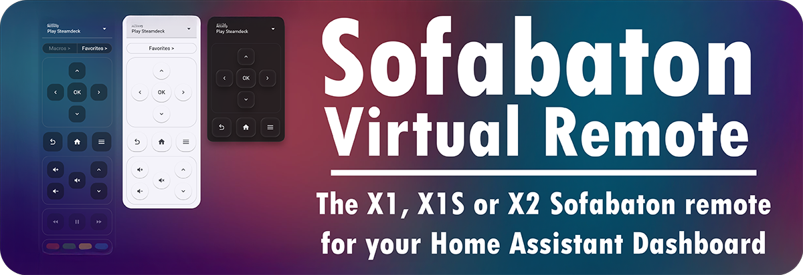

# Sofabaton Virtual Remote for Home Assistant

[](https://github.com/hacs/integration)


A highly customizable virtual remote for your lovelace dashboard. It works with the **Sofabaton X1, X1S, and X2** remotes.

## ⚠️ Before installing
**This card does not work standalone**, it is a frontend component only. It is dependent on an `integration` that communicates with the hub, via Home Assistant's backend.
You will need to have that integration installed and working, before you can use this card.

  - If you have an **X1 or X1S** remote, install and configure the **Sofabaton X1S** integration via [`HACS`](https://my.home-assistant.io/redirect/hacs_repository/?owner=m3tac0de&repository=home-assistant-sofabaton-x1s&category=integration) or [`Github`](https://github.com/m3tac0de/home-assistant-sofabaton-x1s). This integration is also compatible with the **X2** remote.
  - If you have an **X2** remote, install and configure the **Official Sofabaton Hub** integration via [`HACS`](https://my.home-assistant.io/redirect/hacs_repository/?owner=yomonpet&repository=ha-sofabaton-hub&category=integration) or [`Github`](https://github.com/yomonpet/ha-sofabaton-hub).

> [!IMPORTANT]
> While the card functions identically across both integrations, **Wifi Commands** (triggering HA actions from physical buttons) are exclusive to the **Sofabaton X1S** integration.


## ✨ Features
* **It's your remote, in Home Assistant**: Mirrors how you've set up your physical remote, including macros and favorites.
* **Works with all Sofabaton hubs**: Compatible with the Sofabaton X1, X1S, and X2 hubs.
* **Theming friendly**: The virtual remote plays nice with your dashboard's theme, or override it for a different one.
* **Custom Layouts**: Show only the button groups you need (D-pad, Volume, etc.), make layouts per Activity.
* **Automation Assist**: Designed to simplify the creation of your own UIs and automations. Run Actions on button presses and Activity changes. Learn how to send any command to the hub.
  * **Wifi Commands**: Map Actions in Home Assistant directly to physical buttons or favorites on your physical remote, configure entirely via the UI. (`sofabaton_x1s` integration only)
  * **Key capture**: Record keypresses in the virtual remote and receive them as YAML, to replay them in your own UI or automation.
* **Responsive Design**: The card scales to however much space it has. Tweak its behavior by setting a maximum width.
* **Configure via the UI**: No need for YAML.


## 📸 Screenshots
  

---

## 🚀 Installation

### Via HACS (Recommended)
1. Open **HACS** in Home Assistant.
2. Search for "Sofabaton Virtual Remote" and click **Download**.

### Manual Installation
1. Download the `sofabaton-virtual-remote.js` from the [latest release](https://github.com/m3tac0de/sofabaton-virtual-remote/releases).
2. Upload it to your `<config>/www/` directory.
3. Add the resource to your Dashboard configuration:
   - **URL:** `/local/sofabaton-virtual-remote.js`
   - **Type:** `JavaScript Module`

---

## 🛠 Configuration
The card is best configured using the Visual Editor. Just add a new card to your dashboard and search for **Sofabaton Virtual Remote**.

Once in the card configuration panel, select your remote/hub from the dropdown. The dropdown will only contain remote entities that are compatible with the card, so you can't go wrong here.
After that, just play around with the settings.

If you prefer YAML, this is the minimal implementation:

```yaml
type: custom:sofabaton-virtual-remote
entity: remote.x2_hub    # the remote entity added by the Sofabaton integration.
```

Here is the full list of options:

| Key | Type | Description | Default |
| :--- | :--- | :--- | :--- |
| `entity` | string | The `remote.` entity of your Sofabaton device. | **Required** |
| `max_width` | number | Limits how wide the remote grows. | `360` |
| `show_automation_assist` | boolean | Show/hide the Automation Assist panel. | `false` |
| `show_activity` | boolean | Show/hide the activity selector. | `true` |
| `show_dpad` | boolean | Show/hide the directional pad. | `true` |
| `show_volume` | boolean | Show/hide Volume controls. | `true` |
| `show_channel` | boolean | Show/hide Channel controls. | `true` |
| `show_mid` | boolean | Show/hide Home, Menu, and Back buttons. | `true` |
| `show_media` | boolean | Show/hide Play/Pause, Rew, Fwd buttons. | `true` |
| `show_dvr` | boolean | Show/hide the X2 DVR, Pause, Exit buttons. | `true` |
| `show_colors` | boolean | Show/hide Red, Green, Yellow, Blue buttons. | `true` |
| `show_abc` | boolean | Show/hide the X2 A/B/C buttons. | `true` |
| `show_macros_button`| boolean | Toggle the Macros drawer button. | `true` |
| `show_favorites_button`| boolean | Toggle the Favorites drawer button. | `true` |
| `custom_favorites` | list | List of custom buttons for the drawer. | `[]` |
| `theme` | string | Set a specific theme for this card. | `""` |
| `background_override` | list/object | Override the card background (e.g., [33, 33, 33]). | `null` |
| `group_order` | list | Change the order of the button groups. | `activities, macro_favorites, dpad, nav, mid, media, colors, abc` |
| `layouts` | map / object | Set Layout Options per Activity ID. | `{}` |

```yaml
type: custom:sofabaton-virtual-remote
entity: remote.x2_hub
show_colors: false           # color buttons hidden in every Activity
layouts:
  "101":
    show_activity: false     # Activity select hidden in Activity 101
    group_order:             # Custom group order for Activity 101
      - activity
      - dpad
      - nav
      - mid
      - media
      - colors
      - abc
      - macro_favorites
```

### Automation Assist

     

It has 3 features to help make your own UIs and Automations:

*  **Wifi Commands (X1 / X1S / X2)**  
   ⚠️ Only available with the `sofabaton_x1s` integration.

   **[Physical Button] → [Sofabaton Hub] → [Home Assistant Action]**  
   This feature runs Home Assistant Actions when buttons are pressed on the physical remote.  
   Configuration is performed entirely through the Home Assistant UI and then synced to the hub.

   For more details, see here [`sofabaton_x1s/docs/wifi_commands.md`](https://github.com/m3tac0de/home-assistant-sofabaton-x1s/blob/main/docs/wifi_commands.md).  

*  **Key capture → copy/paste code (X1 / X1S / X2)**

   When enabled, the card captures button presses and Activity changes on your virtual remote and sends a Notification, available in your Home Assistant sidebar, containing YAML to reproduce that button press in:
    * your dashboard (a Lovelace button that triggers the same command)
    * a script / automation action (a ready-to-use service call)

    For more details, see here [`docs/keycapture.md`](docs/keycapture.md).
  
*  **MQTT device triggers (X2 only)**
   
   This feature creates descriptive Home Assistant triggers for MQTT commands and Activity changes — without having to copy/paste MQTT topics and JSON payloads by hand.

   Instead of:
   * **Topic**: `F19879827938423/up`
   * **Payload**: `{"device_id":1,"key_id":1}`

   You get:
   * **Device**: `X2 → [YOUR DEVICE NAME]`
   * **Trigger**: `Dim the lights`

   For more details, see here [`docs/automation_triggers.md`](docs/automation_triggers.md).

```


---
## License
MIT © 2026 m3tac0de.
