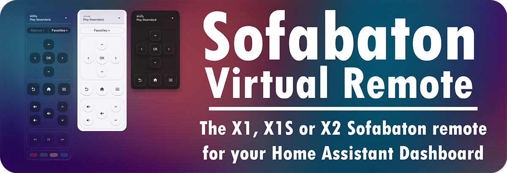

# Sofabaton Virtual Remote for Home Assistant

[](https://github.com/hacs/integration)


A highly customizable virtual remote for your lovelace dashboard. It works with the **Sofabaton X1, X1S, and X2** remotes.

> [!NOTE]
> This is an unofficial community project and is not affiliated with or endorsed by Sofabaton.

## ⚠️ Before installing

**This card does not work standalone**, it is a frontend component only. It is dependent on an `integration` that communicates with the hub, via Home Assistant's backend.
You will need to have that integration installed and working, before you can use this card.

2 options:

- **[X1, X1S, X2]** Install and configure the **Sofabaton X** integration via [`HACS`](https://my.home-assistant.io/redirect/hacs_repository/?owner=m3tac0de&repository=home-assistant-sofabaton-x1s&category=integration) or [`Github`](https://github.com/m3tac0de/home-assistant-sofabaton-x1s).
- **[X2]** Install and configure the **Official Sofabaton Hub** integration via [`HACS`](https://my.home-assistant.io/redirect/hacs_repository/?owner=yomonpet&repository=ha-sofabaton-hub&category=integration) or [`Github`](https://github.com/yomonpet/ha-sofabaton-hub).

Activity mode (including the X2 number pad), card styling, and hold-to-repeat work with both integrations. Device mode, per-device shortcuts, device power control, and configured hub long-press assignments require the **Sofabaton X integration 0.6.7 or newer** with **Persistent Cache** enabled.

## ✨ Features

- **It's your remote, in Home Assistant**: Mirrors how you've set up your physical remote. Control Activities, including their macros and favorites.
- **Works with all Sofabaton hubs**: Compatible with the Sofabaton X1, X1S, and X2 hubs.
- **Theming friendly**: Use flat, tinted, elevated, or glossy buttons, optionally add accent-tinted group panels, and follow your dashboard theme or apply a different theme to the card.
- **Custom Layouts**: Show only the button groups you need (Direction Pad, Volume, etc.), and create layouts per Activity or device.
- **Device mode** _(Sofabaton X integration only)_: Control any device configured on the hub using its button bindings, complete searchable command list, up to three custom shortcuts, and configured Power control. Device mode works independently of Activities. See [`docs/device_mode.md`](docs/device_mode.md).
- **Long-press support** _(Sofabaton X integration only)_: Hold a supported button for 500 ms to send the long-press assignment configured on the hub. This works automatically when Persistent Cache is enabled.
- **Hold-to-repeat**: Hold a selected Volume, Channel, or Direction Pad button to send its command repeatedly, as on the physical remote. This is off by default, and you can choose which button groups take part.
- **Automation Assist**: Record keypresses in the virtual remote and receive ready-to-use YAML for your own dashboard or automations. X2 users can also create MQTT device triggers.
- **Responsive Design**: The card scales to however much space it has. Tweak its behavior by setting a maximum width.
- **Configure via the UI**: No need for YAML.

## 📸 Screenshots

  

---

## 🚀 Installation

### Included with Sofabaton X

The **Sofabaton X** integration includes and registers the card automatically, there is no need to install it separately. You can add it from the dashboard card picker without installing a separate frontend plugin.

If you install the card separately through HACS, the integration stops registering its bundled copy after the next Home Assistant restart. Update the HACS card separately to receive new card features; updating the integration alone does not update that copy.

Users of the **Official Sofabaton Hub** integration need the separate card installation below.

### Separate installation via HACS

1. Open **HACS** in Home Assistant.
2. Search for "Sofabaton Virtual Remote" and click **Download**.

### Manual Installation

1. Download the `sofabaton-virtual-remote.js` from the [latest release](https://github.com/m3tac0de/sofabaton-virtual-remote/releases/latest).
2. Upload it to your `<config>/www/` directory.
3. Add the resource to your Dashboard configuration:
   - **URL:** `/local/sofabaton-virtual-remote.js`
   - **Type:** `JavaScript Module`

---

## 🛠 Configuration

The card is best configured using the Visual Editor. Just add a new card to your dashboard and search for **Sofabaton Virtual Remote**.

Once in the card configuration panel, select your remote/hub from the dropdown. The dropdown will only contain remote entities that are compatible with the card, so you can't go wrong here.
After that, just play around with the settings.

If you prefer YAML, this is the minimal implementation:

```yaml
type: custom:sofabaton-virtual-remote
entity: remote.x2_hub # the remote entity added by the Sofabaton integration.
```

### Card-wide options

These settings belong at the top level of the card configuration and apply in both Activity and Device modes. Layout visibility and ordering are listed separately below.

| Key | Type | Description | Default |
| --- | --- | --- | --- |
| `type` | string | Lovelace card type. | Required: `custom:sofabaton-virtual-remote` |
| `entity` | string | The `remote.` entity supplied by your Sofabaton integration. | Required |
| `max_width` | number / string / null | Maximum width: a number in pixels, or a CSS length such as `"100%"`. Use `0`, `null`, or `""` for no card-specific limit. The visual editor offers 230–1200 px; YAML also accepts the other forms. | `360` |
| `key_style` | string | Button style: `flat`, `tinted`, `elevated`, or `glossy`. Legacy `panel` is treated as flat buttons with tinted panels. | `flat` |
| `tinted_panels` | boolean | Accent-tinted backgrounds behind button groups; combines with any button style. | `false` |
| `theme` | string | Home Assistant theme for this card; empty follows the dashboard theme. | `""` |
| `background_override` | RGB list / object / null | Card background, for example `[33, 33, 33]` or `{r: 33, g: 33, b: 33}`. `null` uses the theme. The editor's background switch manages this value; `use_background_override` is not a saved setting. | `null` |
| `show_automation_assist` | boolean | Enable **General Options → Key capture**. | `false` |
| `hold_repeat` | object | Hold-to-repeat settings; see the table below. | `{}` |
| `layouts` | object | Activity layout defaults and per-Activity overrides; see below. | `{}` |
| `device_mode` | object | Device mode enablement, initial device, layouts, and shortcuts. Sofabaton X only; see the [complete Device mode reference](docs/device_mode.md#configuration-reference). | Enabled when available |

`hold_repeat` has these fields:

| Field | Type | Description | Default |
| --- | --- | --- | --- |
| `enabled` | boolean | Enable repeated commands while holding selected controls. The first hold command fires after 400 ms, then every 250 ms until release. | `false` |
| `volume` | boolean | Repeat Volume Up/Down; Mute does not repeat. | `true` when enabled |
| `channel` | boolean | Repeat Channel Up/Down. | `true` when enabled |
| `dpad` | boolean | Repeat Up/Down/Left/Right; OK does not repeat. | `true` when enabled |

These are the only groups that support hold-to-repeat. It works with both integrations. Configured hub long-press assignments are a separate feature; see [Long-press support](#long-press-support).

### Activity layout options

Put shared layout settings in `layouts.default`, and overrides in `layouts["<activity id>"]`. Top-level layout keys remain supported: the order of precedence is built-in defaults, top-level layout keys, `layouts.default`, then the selected Activity's overrides. The visual editor saves shared settings under `layouts.default`.

Device layouts are independent and use `device_mode.layouts`; they do not inherit Activity layout settings. Styling, sizing, and other card-wide settings cannot be overridden per layout.

| Key | Type | Description | Default |
| --- | --- | --- | --- |
| `show_activity` | boolean | Show the Activity selector row. Hiding it also hides the mode switch in that row. | `true` |
| `show_device_toggle` | boolean | Show the Activity/Device mode switch when Device mode is available. Hiding the switch does not disable Device mode; use `device_mode.enabled` for that. | `true` |
| `show_dpad` | boolean | Show the Direction Pad. An available number pad can remain visible with this off. | `true` |
| `show_numpad` | boolean | Allow the X2 number pad when at least one numeric key is assigned. Open it with the dialpad button in the Direction Pad's corner. | `true` |
| `show_nav` | boolean | Show Back, Home, and Menu. | `true` |
| `show_volume` | boolean | Show Volume Up/Down and Mute. | `true` |
| `show_channel` | boolean | Show Channel controls. | `true` |
| `show_mid` | boolean | Legacy fallback for Volume and Channel when their individual switches are absent. Prefer `show_volume` and `show_channel`. | `true` |
| `show_media` | boolean | Show the playback controls (Rewind, Play/Pause, Fast Forward). | `true` |
| `show_dvr` | boolean | Show the X2 DVR, Pause, and Exit controls. | `true` |
| `show_colors` | boolean | Show Red, Green, Yellow, and Blue. | `true` |
| `show_abc` | boolean | Show the X2 A/B/C buttons. | `true` |
| `show_macros_button` | boolean | Show Macros, either as a drawer button or an inline row. | `true` |
| `show_favorites_button` | boolean | Show Favorites, either as a drawer button or an inline row. | `true` |
| `show_favorite_device_names` | boolean | Label Favorites with their device names. Requires Sofabaton X and Persistent Cache; see [Device names on Favorites](#device-names-on-favorites). | `false` |
| `mf_as_rows` | boolean | Show Macros and Favorites as separate scrollable rows instead of drawers. | `false` |
| `mf_row_visible_rows` | number | Visible button rows in each inline Macros/Favorites group before scrolling, from 1 to 6. Applies when `mf_as_rows` is `true`. | `2` |
| `group_order` | list | Order the groups using the names below. Omitted groups are appended in default order; use visibility switches to hide them. | Order below |

Default `group_order`:

```yaml
group_order:
  - activity
  - macro_favorites
  - macros_row
  - favorites_row
  - dpad
  - nav
  - mid
  - media
  - colors
  - abc
  - shortcuts
```

`macros_row` and `favorites_row` render only with `mf_as_rows: true`; `macro_favorites` renders in drawer mode. `shortcuts` is used only in Device mode. Volume and Channel share `mid`; playback and DVR controls share `media`. The number pad shares `dpad` and has no separate group name.

Per-activity layout example: hide the color buttons everywhere, but in Activity 101 also hide the activity selector and reorder the groups:

```yaml
type: custom:sofabaton-virtual-remote
entity: remote.x2_hub
layouts:
  default:
    show_colors: false # color buttons hidden in every Activity
  "101":
    show_activity: false # Activity select hidden in Activity 101
    group_order: # Custom group order for Activity 101
      - activity
      - dpad
      - nav
      - mid
      - media
      - colors
      - abc
      - macro_favorites
```
### Long-press support

Long-press support is separate from `hold-to-repeat` and requires no card setting. With the Sofabaton X integration 0.6.7 or newer and Persistent Cache enabled, the card automatically follows long-press assignments configured on the hub in both Activity and Device modes.

A short tap sends the normal command. Holding an assigned button for 500 ms sends its configured long-press command once, with haptic feedback where available. Releasing the button does not also send the short-press command.

> If `hold-to-repeat` and a configured hub long-press assignment apply to the same button, hold-to-repeat takes precedence.

### Device mode

_(Sofabaton X integration only)_

Device mode lets the remote control one device configured on the hub. The card uses that device's button bindings and adds a searchable drawer containing its complete command list. It also provides up to three per-device shortcut buttons and a Power button for devices with power control configured. It works independently of Activities, so you can reach any command on any device even when no Activity is running. This is useful for occasional commands that are not part of an Activity or for building a dedicated per-device remote.

It requires the Sofabaton X integration with persistent caching enabled; the card hides all Device mode functionality when it is not available. Full documentation, including the `device_mode` configuration block and per-device layouts: [`docs/device_mode.md`](docs/device_mode.md).

### Automation Assist

  

Automation Assist provides two ways to help build your own dashboards and automations. Enable **General Options → Key capture** to use them.

- **Key capture → copy/paste code (X1 / X1S / X2)**

  When enabled, the card captures button presses and Activity changes on your virtual remote and sends a Notification, available in your Home Assistant sidebar, containing YAML to reproduce that button press in:
  - your dashboard (a Lovelace button that triggers the same command)
  - a script / automation action (a ready-to-use service call)

  For more details, see here [`docs/keycapture.md`](docs/keycapture.md).

- **MQTT device triggers (X2 only)**

  This feature creates descriptive Home Assistant triggers for MQTT commands and Activity changes — without having to copy/paste MQTT topics and JSON payloads by hand.

  Instead of:
  - **Topic**: `F19879827938423/up`
  - **Payload**: `{"device_id":1,"key_id":1}`

  You get:
  - **Device**: `X2 → [YOUR DEVICE NAME]`
  - **Trigger**: `Dim the lights`

  For more details, see here [`docs/automation_triggers.md`](docs/automation_triggers.md).

---

## License

MIT © 2026 m3tac0de.
